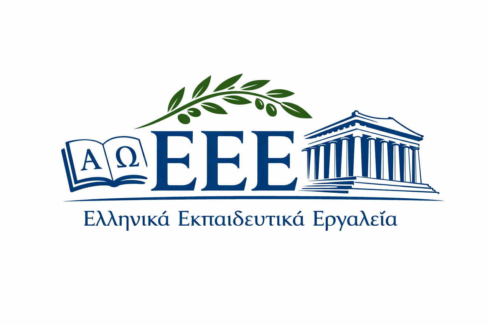

  

# Ελληνικά Εκπαιδευτικά Εργαλεία (EEE) — Greek Language Educational Tools

**EEE** is a framework for building interactive [Marimo](https://marimo.io) notebooks with automatic morphological validation for Greek language learning. It enables instructors and learners to create custom interactive educational materials with word-form testing exercises.

## Framework Overview

This is not just a collection of exercises — it's a reusable framework for:
- **Educators & Methodologists**: Embed interactive tests directly into teaching materials; create exercises from your own word lists and course notes
- **Students**: Systematize notes with interactive assignments; build personalized tests from required vocabulary
- **Developers**: Use the modular architecture to extend with new test types, languages, or morphological features

## Example Applications

Ready-to-use demo applications:
- **Telegram Mini App**: https://t.me/eee_greek_bot/modern_greek_test
- **Web version of the Mini App**: https://eee-project.codeberg.page/modern-greek-eee-tg-mini-app/

They are based on example Marimo notebooks that demonstrate the framework:
- **Noun Declension Tester**: https://molab.marimo.io/notebooks/nb_KZYjBCXm1jiSjMBnvxWezi/app
- **Verb Conjugation Tester**: https://molab.marimo.io/notebooks/nb_HJPdFCQMSBvpw3EafKK88v/app
- **Adjective Declension Tester**: https://molab.marimo.io/notebooks/nb_C7b5s58CeEseJvBWTbw8Px/app
  
These examples showcase the framework's capabilities: built-in word samples, custom CSV/TSV upload, automatic form generation, and real-time validation.

## Repositories

The project includes the following repositories:
- **Container for generating EEE-based educational notebooks**: https://github.com/EEE-project/modern-greek-eee-container
- **Claude Code skills**: https://github.com/EEE-project/modern-greek-eee-skills
- **Library with EEE components for Marimo notebooks**: https://github.com/EEE-project/modern-greek-eee

## Get Involved

- Source: https://github.com/EEE-project/modern-greek-eee
- Community (Telegram): https://t.me/eee_greek
